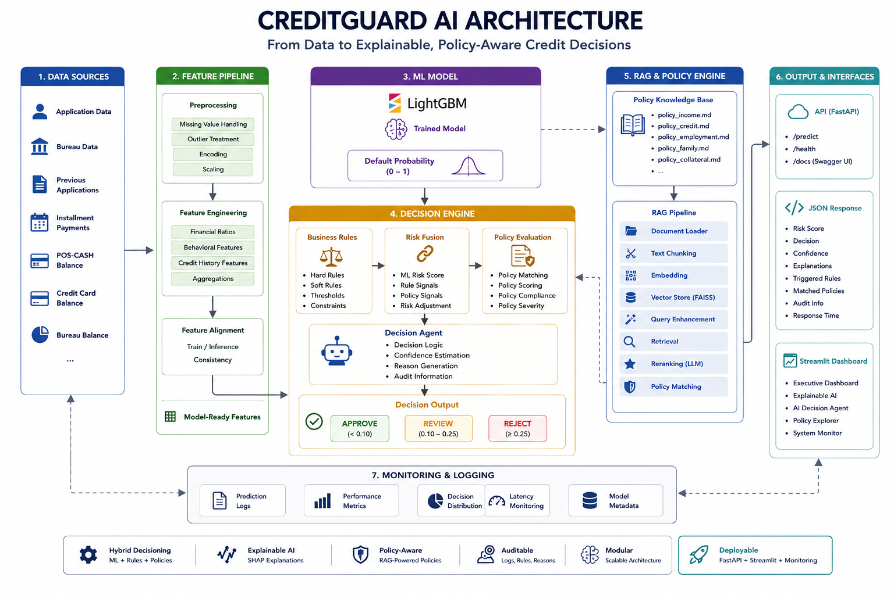
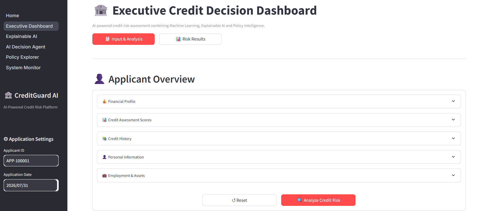
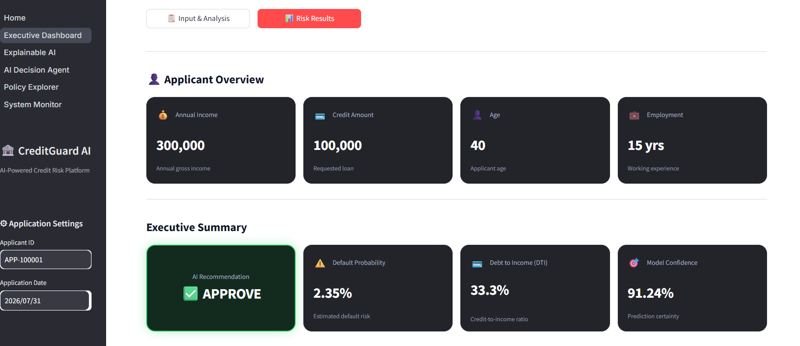

# 🛡️ CreditGuard AI

### AI-Powered Credit Risk Assessment & Decision Support System

CreditGuard AI is an end-to-end credit risk assessment platform that combines **machine learning, explainable AI, RAG-based policy intelligence, business rules, and an AI decision agent**.

The system goes beyond default prediction by transforming model risk scores into an auditable:

**APPROVE · REVIEW · REJECT**

decision with explanations, policy matches, triggered rules, confidence information, and monitoring.

---

## 🏗️ Architecture



---

## ✨ Key Features

* **LightGBM Credit Risk Model** — Default probability prediction with Optuna optimization and 5-fold cross-validation.
* **Hybrid Decision Agent** — Combines ML risk, business rules, and policy evaluation.
* **RAG Policy Intelligence** — Retrieves and reranks relevant credit policies using FAISS and embeddings.
* **Explainable AI** — SHAP-based feature contribution analysis.
* **FastAPI Inference API** — Real-time credit risk prediction through REST endpoints.
* **Streamlit Dashboard** — Interactive risk assessment, explanations, policy exploration, and system monitoring.
* **Audit & Monitoring** — Prediction logs, decision distribution, confidence, latency, and model metadata.

### Decision Thresholds

| Final Risk Score | Decision       |
| ---------------: | -------------- |
|         `< 0.10` | 🟢 **APPROVE** |
|  `0.10 – < 0.25` | 🟡 **REVIEW**  |
|         `≥ 0.25` | 🔴 **REJECT**  |

> These are project-specific decision thresholds, not universal banking standards.

---

## 🔍 Explainable AI

SHAP is used **only for model explainability** and is intentionally excluded from the risk and decision score.

```text
Applicant Features → LightGBM → Default Probability
                              ↓
                             SHAP
                              ↓
                    Feature Contributions
```

The Explainable AI dashboard highlights the features contributing most strongly to each prediction.

---

## 📚 RAG & Policy Intelligence

The policy knowledge base currently includes:

```text
data/policies/
├── policy_income.md
├── policy_credit.md
├── policy_employment.md
├── policy_family.md
└── policy_collateral.md
```

RAG pipeline:

```text
Documents
   ↓
Chunking
   ↓
Embedding
   ↓
FAISS
   ↓
Retrieval
   ↓
LLM Reranking
   ↓
Policy Matching
```

---

## 📊 Machine Learning

### Dataset

**Home Credit Default Risk**

The pipeline combines application, bureau, previous application, installment, POS-CASH, credit card, and bureau balance information into engineered financial and behavioral features.

Examples:

```text
credit_income_ratio
annuity_income_ratio
credit_term
age_years
employment_years
bureau_total_debt
bureau_debt_credit_ratio
approval_rate
refusal_rate
```

### Model Performance

| Metric       |        Result |
| ------------ | ------------: |
| Mean ROC-AUC |    **0.7828** |
| Std          |    **0.0029** |
| Validation   | **5-Fold CV** |

> Development evaluation results; not production lending performance.

---

## 🖥️ Dashboard

| Page                   | Purpose                          |
| ---------------------- | -------------------------------- |
| 📊 Executive Dashboard | Credit risk KPIs and overview    |
| 🔍 Explainable AI      | SHAP prediction explanations     |
| 🤖 AI Decision Agent   | Credit decision and reasoning    |
| 📚 Policy Explorer     | Policy search and inspection     |
| 🖥️ System Monitor     | Prediction and system monitoring |





---

## 🧰 Technology Stack

**Machine Learning**
`Python · LightGBM · Scikit-learn · Optuna · Pandas · NumPy · SHAP`

**Generative AI / RAG**
`FAISS · Sentence Transformers · MiniLM · LLM Reranking · RAG`

**Backend**
`FastAPI · Uvicorn · Pydantic`

**Frontend**
`Streamlit · Plotly`

**Development**
`Git · GitHub · Jupyter`

---

## 📁 Project Structure

```text
creditguard-ai/
├── assets/
├── data/
│   └── policies/
├── notebooks/
├── src/
│   ├── agent/
│   ├── api/
│   ├── explainability/
│   ├── rag/
│   └── utils/
├── streamlit/
│   ├── components/
│   ├── pages/
│   ├── ui/
│   └── utils/
├── artifacts/
├── requirements.txt
├── .gitignore
└── README.md
```

---

## 🚀 Installation

```bash
git clone https://github.com/rabiadurgt/creditguard-ai.git
cd creditguard-ai

python -m venv venv
```

### Windows

```bash
venv\Scripts\activate
```

### Install Dependencies

```bash
pip install -r requirements.txt
```

---

## ▶️ Run the Application

### 1. Start FastAPI

From the project root:

```bash
uvicorn src.api.app:app --reload
```

API:

```text
http://127.0.0.1:8000
```

Swagger:

```text
http://127.0.0.1:8000/docs
```

### 2. Start Streamlit

Open another terminal:

```bash
cd streamlit
streamlit run Home.py
```

Dashboard:

```text
http://localhost:8501
```

---

## 🔌 API

### `POST /predict`

Real-time credit risk prediction endpoint returning:

`Risk Score · Decision · Risk Level · Confidence · Explanations · Policy Matches · Audit Information · Response Time`

Interactive API documentation:

`http://127.0.0.1:8000/docs`
---

## 🔮 Future Improvements

* Automated model retraining
* Drift monitoring
* Docker / CI/CD deployment
* Model registry
* RAG evaluation
* Human-in-the-loop review
* Fairness analysis

---

## ⚠️ Disclaimer

CreditGuard AI is an educational and engineering project demonstrating **ML, Explainable AI, RAG, AI agents, and MLOps-oriented system design**.

The decision thresholds and policies are project-specific assumptions and should not be used for real-world lending decisions without appropriate validation, regulatory review, risk governance, and domain expertise.

---

## 👩‍💻 Author

**Rabia Durgut**
Computer Engineering Graduate | AI Engineer

[GitHub](https://github.com/rabiadurgt) · [LinkedIn](https://www.linkedin.com/in/rabiadurgut/)

---

### ⭐ CreditGuard AI

**From default prediction to explainable, policy-aware credit decisions.**
