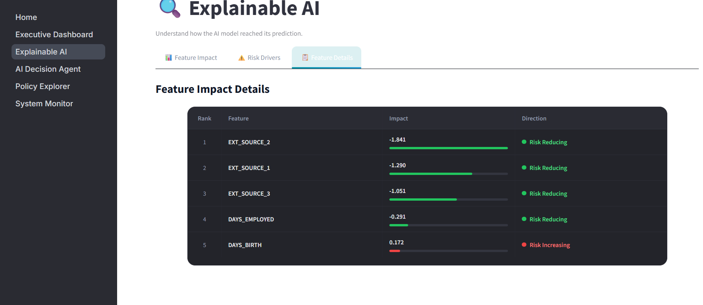
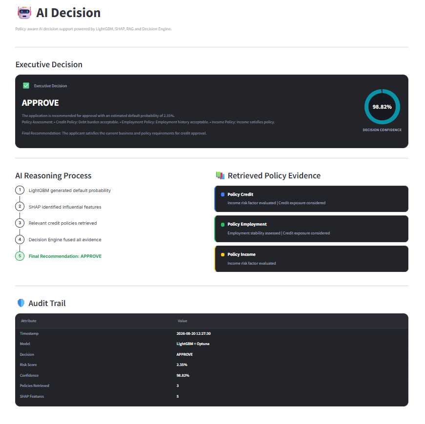
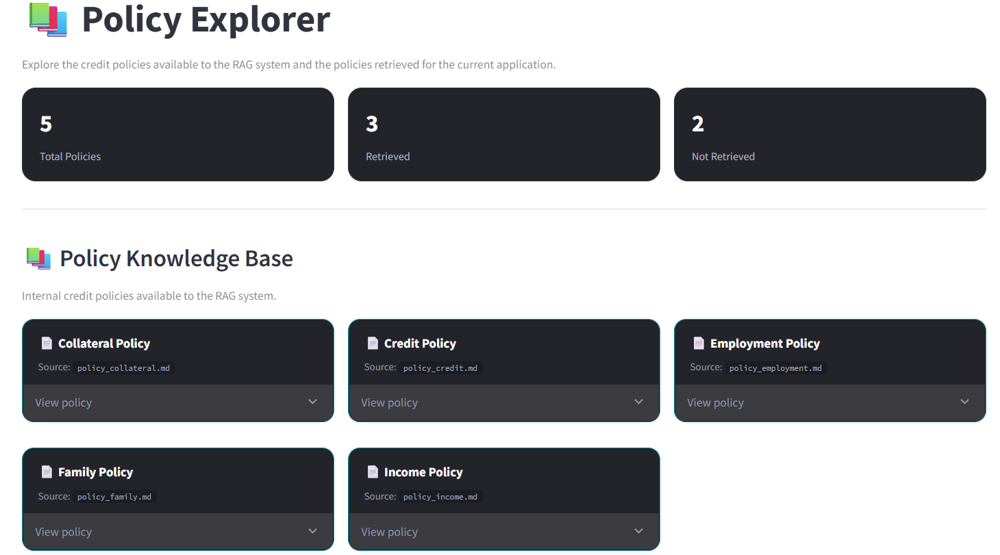
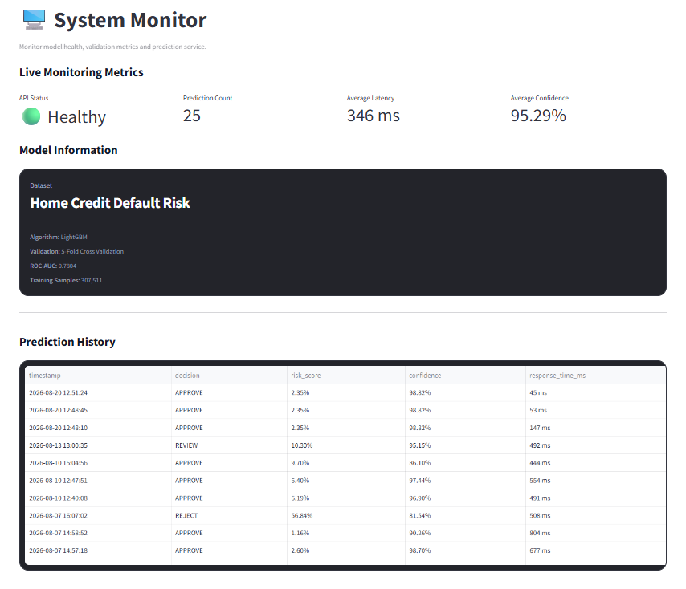
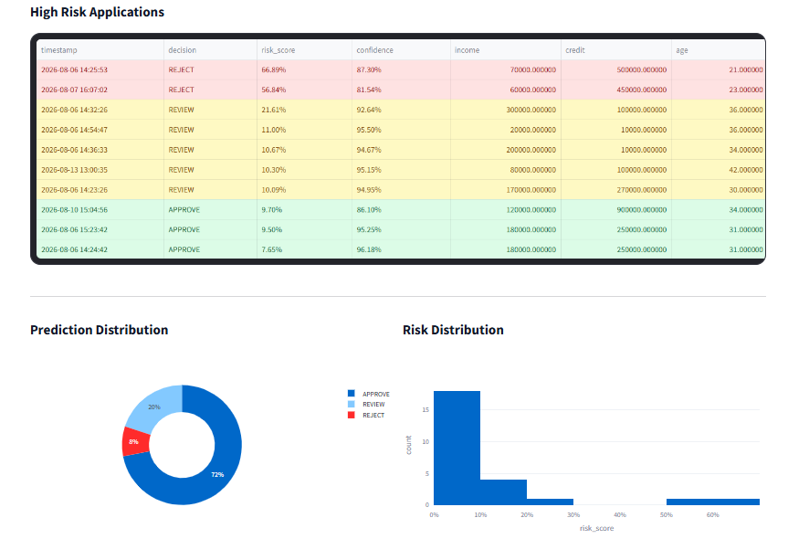

# 🛡️ CreditGuard AI

### AI-Powered Credit Risk Assessment & Decision Support System

CreditGuard AI is an end-to-end **AI-powered credit risk assessment and decision support platform** that combines **Machine Learning, Explainable AI, RAG-based policy intelligence, business rules, and an AI decision agent**.

The system goes beyond predicting default probability. It transforms model predictions into an auditable credit decision:

**APPROVE · REVIEW · REJECT**

Each decision is supported by risk scores, explanations, policy matches, triggered business rules, confidence information, and monitoring data.

---

## 🏗️ Architecture


CreditGuard AI follows a modular architecture that separates **data processing, machine learning, explainability, policy intelligence, decision logic, API inference, and the user interface**.

The system demonstrates how an ML prediction can be transformed into a complete and interpretable **credit decision workflow**.

---

## ✨ Key Features

* **LightGBM Credit Risk Model** — Predicts default probability using Optuna optimization and 5-fold cross-validation.

* **Hybrid Decision Agent** — Combines ML risk scores, business rules, and policy evaluation to generate the final credit decision.

* **RAG Policy Intelligence** — Retrieves and reranks relevant credit policies using embeddings and FAISS.

* **Explainable AI** — Uses SHAP to identify the features contributing most strongly to individual predictions.

* **FastAPI Inference API** — Provides real-time credit risk prediction through REST endpoints.

* **Streamlit Dashboard** — Provides interactive risk assessment, explainability, policy exploration, AI-assisted decisions, and system monitoring.

* **Audit & Monitoring** — Tracks predictions, decisions, confidence, response time, and system-level metrics.

---

## 🎯 Credit Decision Framework

The final decision is based on the project's risk scoring and decision logic.

| Final Risk Score | Decision       |
| ---------------: | -------------- |
|         `< 0.10` | 🟢 **APPROVE** |
|  `0.10 – < 0.25` | 🟡 **REVIEW**  |
|         `≥ 0.25` | 🔴 **REJECT**  |

> These are project-specific decision thresholds and are not intended to represent universal banking or regulatory standards.

---

## 🖥️ Dashboard

The CreditGuard AI dashboard provides a complete view of the credit assessment workflow.

| Page                       | Purpose                                                        |
| -------------------------- | -------------------------------------------------------------- |
| 📊 **Executive Dashboard** | Credit risk KPIs and portfolio overview                        |
| 🔍 **Explainable AI**      | SHAP-based prediction explanations                             |
| 🤖 **AI Decision Agent**   | Final credit decision and reasoning                            |
| 📚 **Policy Explorer**     | Policy retrieval, matching, and inspection                     |
| 🖥️ **System Monitor**     | Prediction, performance, risk analytics, and system monitoring |

### Executive Dashboard

Provides a high-level overview of credit risk metrics, decisions, model information, and prediction statistics.


---

### Risk Prediction

Displays the applicant's predicted default probability, risk level, decision, confidence, and supporting information.


---

### Explainable AI

Provides detailed feature-level explanations using SHAP, including feature ranking, impact, and contribution direction.



---

### AI Decision Agent

Combines the model prediction with business rules and retrieved policy information to generate an auditable credit decision.

The decision view includes:

* Executive Decision
* Decision Reasoning
* Policy Evidence
* Audit Trail



---

### Policy Explorer

Provides an interface for exploring the credit policy knowledge base, including policy statistics and individual policy knowledge cards.



---

### System Monitor — Overview

The System Monitor provides real-time monitoring information including live monitoring metrics, model information, and prediction history.



---

### System Monitor — Risk Analytics

The risk analytics section provides deeper monitoring of credit predictions, including high-risk applications and prediction/risk distribution visualizations.



---

## 🔍 Explainable AI

SHAP is used **only for model explainability** and is intentionally excluded from the risk and decision score.

```text
Applicant Features
        │
        ▼
    LightGBM
        │
        ▼
Default Probability
        │
        ▼
       SHAP
        │
        ▼
Feature Contributions
```

The Explainable AI dashboard highlights the features contributing most strongly to each prediction.

This allows users to understand **why a particular applicant received a specific risk score** without mixing explainability outputs into the underlying model prediction.

---

## 📚 RAG & Policy Intelligence

Credit decisions can require more than a model prediction. CreditGuard AI therefore includes a policy intelligence layer that retrieves relevant policy information and incorporates it into the decision workflow.

### Policy Knowledge Base

The current knowledge base includes:

```text
data/policies/

├── policy_income.md
├── policy_credit.md
├── policy_employment.md
├── policy_family.md
└── policy_collateral.md
```

### RAG Pipeline

```text
Documents
    ↓
Chunking
    ↓
Embedding
    ↓
FAISS Vector Store
    ↓
Retrieval
    ↓
LLM Reranking
    ↓
Policy Matching
```

The retrieved policies provide additional context for the AI decision agent and help connect model predictions with predefined credit policies.

---

## 🤖 AI Decision Agent

The decision layer combines multiple sources of information instead of relying exclusively on the ML prediction.

```text
                 ┌──────────────────┐
                 │  ML Risk Score    │
                 └────────┬─────────┘
                          │
                          ▼
                 ┌──────────────────┐
                 │ Business Rules   │
                 └────────┬─────────┘
                          │
                          ▼
                 ┌──────────────────┐
                 │ Policy Matching  │
                 └────────┬─────────┘
                          │
                          ▼
                 ┌──────────────────┐
                 │ Decision Agent   │
                 └────────┬─────────┘
                          │
                          ▼
              APPROVE · REVIEW · REJECT
```

The resulting decision can include:

* Risk score
* Risk level
* Final decision
* Model confidence
* Triggered business rules
* Relevant policy matches
* Decision reasoning
* Audit information

---

## 📊 Machine Learning

### Dataset

**Home Credit Default Risk**

The feature engineering pipeline combines application, bureau, previous application, installment, POS-CASH, credit card, and bureau balance information into engineered financial and behavioral features.

Examples include:

```text
credit_income_ratio
annuity_income_ratio
credit_term
age_years
employment_years
income_per_family_member
bureau_total_debt
bureau_debt_credit_ratio
approval_rate
refusal_rate
```

### Model

The primary credit risk model is **LightGBM**, optimized using **Optuna** and evaluated using **5-fold cross-validation**.

### Model Performance

| Metric             |        Result |
| ------------------ | ------------: |
| Mean ROC-AUC       |    **0.7828** |
| Standard Deviation |    **0.0029** |
| Validation         | **5-Fold CV** |

> These are development evaluation results on the project dataset and should not be interpreted as production lending performance.

---

## 🧰 Technology Stack

### Machine Learning

`Python · LightGBM · Scikit-learn · Optuna · Pandas · NumPy · SHAP`

### Generative AI & RAG

`FAISS · Sentence Transformers · MiniLM · LLM Reranking · RAG`

### Backend

`FastAPI · Uvicorn · Pydantic`

### Frontend

`Streamlit · Plotly`

### Development

`Git · GitHub · Jupyter`

---

## 📁 Project Structure

```text
creditguard-ai/
│
├── assets/
│   ├── architecture.png
│   └── screenshots/
│       ├── 01_executive_dashboard.png
│       ├── 02_risk_prediction_result.png
│       ├── 03_explainable_ai_shap_details.png
│       ├── 04_ai_decision_agent.png
│       ├── 05_policy_explorer.png
│       ├── 06_system_monitor_overview.png
│       └── 07_system_monitor_risk_analytics.png
│
├── data/
│   └── policies/
│
├── notebooks/
│
├── src/
│   ├── agent/
│   ├── api/
│   ├── explainability/
│   ├── rag/
│   └── utils/
│
├── streamlit/
│   ├── components/
│   ├── pages/
│   ├── ui/
│   └── utils/
│
├── artifacts/
├── requirements.txt
├── .gitignore
└── README.md
```

---

## 🚀 Installation

### 1. Clone the Repository

```bash
git clone https://github.com/rabiadurgt/creditguard-ai.git
cd creditguard-ai
```

### 2. Create a Virtual Environment

```bash
python -m venv venv
```

### Windows

```bash
venv\Scripts\activate
```

### 3. Install Dependencies

```bash
pip install -r requirements.txt
```

---

## ▶️ Run the Application

CreditGuard AI consists of a **FastAPI backend** and a **Streamlit frontend**.

### 1. Start FastAPI

From the project root:

```bash
uvicorn src.api.app:app --reload
```

API:

```text
http://127.0.0.1:8000
```

Swagger documentation:

```text
http://127.0.0.1:8000/docs
```

### 2. Start Streamlit

Open another terminal:

```bash
cd streamlit
streamlit run Home.py
```

Dashboard:

```text
http://localhost:8501
```

---

## 🔌 API

### `POST /predict`

The prediction endpoint provides real-time credit risk assessment.

The response can include:

```text
Risk Score
Decision
Risk Level
Confidence
Explanations
Policy Matches
Audit Information
Response Time
```

Interactive API documentation:

```text
http://127.0.0.1:8000/docs
```

---

## 🔄 End-to-End Decision Flow

```text
Applicant Data
      ↓
Feature Engineering
      ↓
Feature Store
      ↓
LightGBM Prediction
      ↓
Default Probability
      ↓
┌─────────────────────────────┐
│ Hybrid Decision Layer       │
│                             │
│ • Business Rules            │
│ • RAG Policy Retrieval      │
│ • Policy Matching           │
│ • Decision Agent            │
└──────────────┬──────────────┘
               ↓
      Final Credit Decision
               ↓
   APPROVE / REVIEW / REJECT
               ↓
┌─────────────────────────────┐
│ Explainability & Audit      │
│                             │
│ • SHAP Contributions        │
│ • Confidence                │
│ • Policy Matches            │
│ • Triggered Rules           │
│ • Response Time             │
└─────────────────────────────┘
```

---

## 🔮 Future Improvements

* Automated model retraining
* Data and model drift monitoring
* Docker / CI/CD deployment
* Model registry integration
* RAG evaluation framework
* Human-in-the-loop review workflow
* Fairness and bias analysis
* Production-grade monitoring

---

## 👩‍💻 Author

**Rabia Durgut**

Computer Engineering Graduate | AI & ML Engineer

[GitHub](https://github.com/rabiadurgt) · [LinkedIn](https://www.linkedin.com/in/rabiadurgut/)

---

## ⭐ CreditGuard AI

**From default prediction to explainable, policy-aware credit decisions.**
